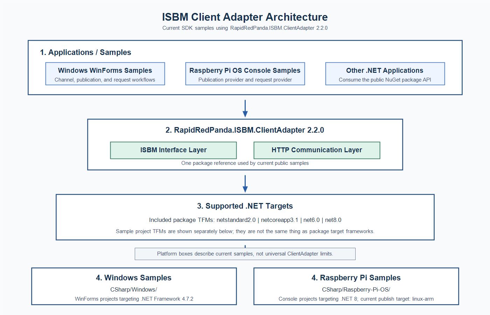
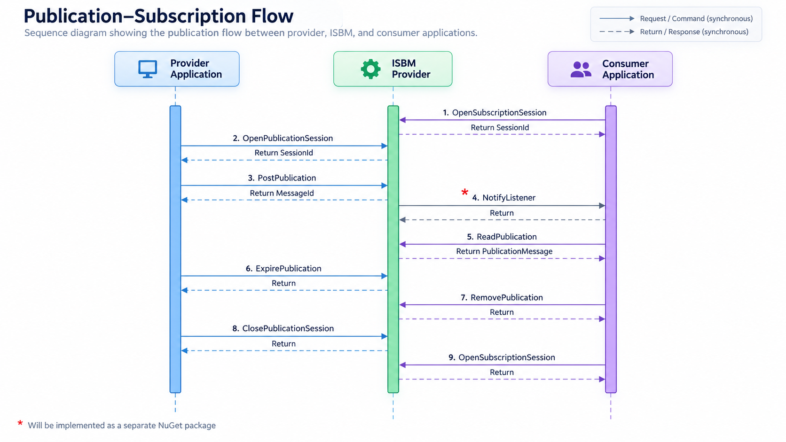
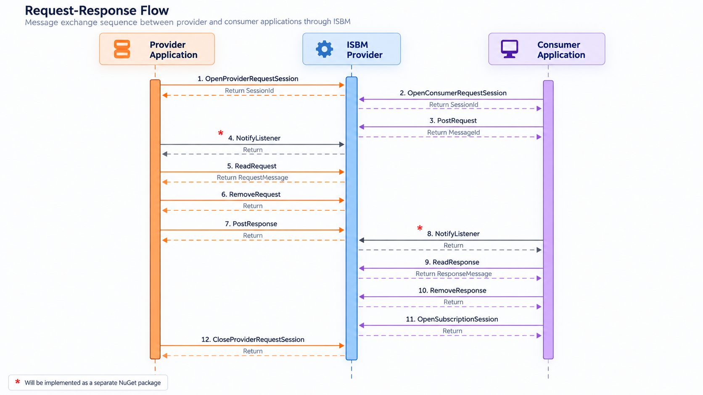
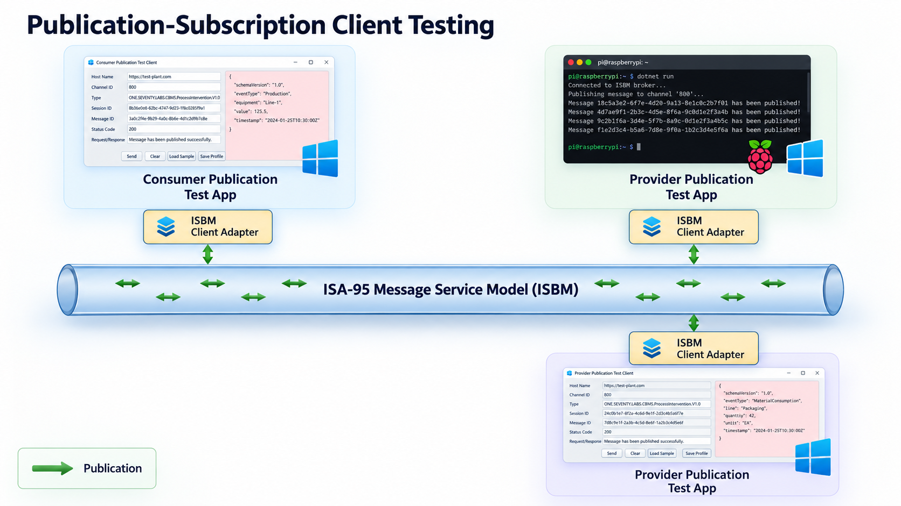
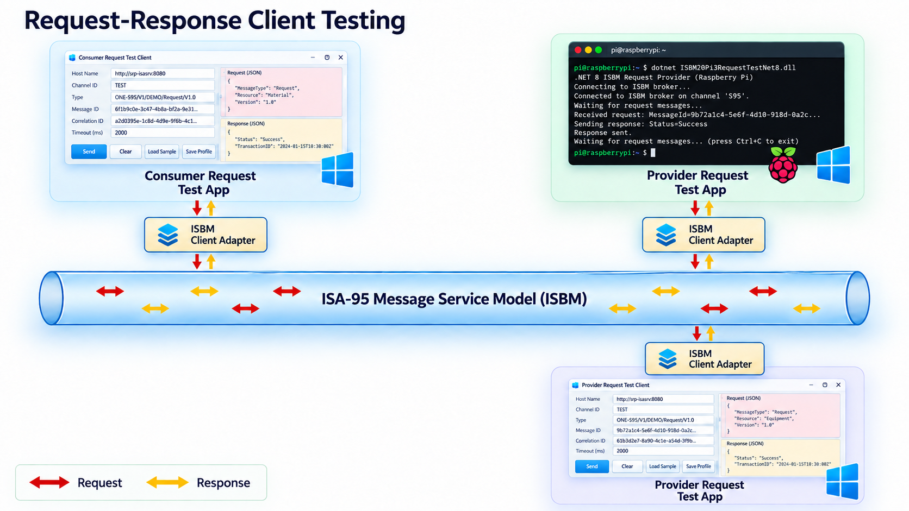

# ISBM-2.0-Client-SDK

## Overview

The ISBM 2.0 Client SDK provides C# samples for exploring the Open Industrial Interoperability Ecosystem (OIIE), the ISA-95 Message Service Model / ISBM 2.0, Publication-Subscription messaging, and Request-Response messaging.

The current samples use the `RapidRedPanda.ISBM.ClientAdapter` 2.2.0 NuGet package.

## Contents
  
1. [Overview](#overview)
2. [Objectives](#objectives)
3. [ISBM Client Adapter Architecture](#isbm-client-adapter-architecture)
4. [Current SDK Contents](#current-sdk-contents)
5. [Sample Platforms](#sample-platforms)
6. [ISBM Message Models](#isbm-message-models)
7. [Publication-Subscription Model](#publication-subscription-model)
8. [Request-Response Model](#request-response-model)
9. [Sample Testing Topology](#sample-testing-topology)
10. [Use Cases](#use-cases)
11. [Before Running the Program](#before-running-the-program)
12. [Useful Links](#useful-links)
13. [Quick Reference](#quick-reference)

## Objectives

The SDK helps developers learn and test ISBM 2.0 communication patterns without implementing the underlying ISA-95 Message Service Model details from scratch. The samples show how Provider Applications and Consumer Applications use the ClientAdapter package to exchange CCOM messages through an ISBM Service Provider.

`RapidRedPanda.ISBM.ClientAdapter` 2.2.0 supports multiple package target frameworks:

- `netstandard2.0`
- `net8.0`
- `net10.0`

Those package target frameworks are separate from the sample project target frameworks. The current Windows samples target .NET Framework 4.7.2, and the current Raspberry Pi OS samples target .NET 8.

## ISBM Client Adapter Architecture



## Current SDK Contents

```text
CSharp/
  Windows/              WinForms samples targeting .NET Framework 4.7.2
  Raspberry-Pi-OS/      Console samples targeting .NET 8
Documents/              Architecture, flow diagrams, and use-case documentation
```

The C# samples are aligned with the released ClientAdapter package:

```xml
<PackageReference Include="RapidRedPanda.ISBM.ClientAdapter" Version="2.2.0" />
```

The samples consume the public ClientAdapter API from NuGet. They do not require an adjacent ClientAdapter source repository or locally copied ClientAdapter DLLs.

## Sample Platforms

### Windows Samples

Path: `CSharp/Windows/`

Technology: WinForms projects targeting .NET Framework 4.7.2.

Sample areas:

- Channel Management
- Publication Provider
- Publication Consumer
- Request Provider
- Request Consumer

### Raspberry Pi OS Samples

Path: `CSharp/Raspberry-Pi-OS/`

Technology: console projects targeting .NET 8.

Sample areas:

- Publication Provider
- Request Provider

The current Raspberry Pi OS publish profiles use `linux-arm`. This is the current sample publish target, not a universal limitation of the ClientAdapter package.

## ISBM Message Models

An ISBM message bus allows different devices, applications, and processes to exchange messages through a shared service. It supports asynchronous, decoupled communication so systems can interoperate without direct point-to-point dependencies.

ISBM 2.0 defines two primary messaging models:

- Publication-Subscription
- Request-Response

## Publication-Subscription Model

In this model, Provider Applications send messages to an ISBM Service Provider, and Consumer Applications receive messages based on subscriptions to specific Publication Channels and Topics.

#### Breakdown of the key components and concepts of the publication-subscription message bus model

#### Provider Applications:

Provider Applications are devices or systems that generate and send messages to the ISBM Service Provider. They produce messages related to specific Topics or events without knowing which Consumer Applications will receive them.

#### Consumer Applications:

Consumer Applications are devices or systems that receive messages from the ISBM Service Provider based on subscriptions to specific Topics and Publication Channels. They express interest in receiving messages about particular Topics or events.

#### ISBM Service Provider:

The ISBM Service Provider acts as an intermediary between Provider Applications and Consumer Applications. It receives messages from providers and distributes them to consumers based on their subscriptions. The ISBM Service Provider manages message routing and delivery so each Consumer Application receives the relevant messages according to its subscriptions.

#### Publication Channels:

A Publication Channel is a logical conduit through which published messages flow between devices or systems within a cluster. It organizes and directs message transmission, helping messages reach intended consumers efficiently. Publication Channels support scalable and flexible message routing across distributed environments.

#### Topics:

A Topic within a Publication Channel represents a distinct subject or message category. Topics organize related messages around common themes or events and allow Consumer Applications to subscribe to the information they need. Messages published to a Topic are delivered to subscribers interested in that Topic, supporting asynchronous communication and event-driven interactions.

#### ISBM Publication-Subscription Message Flow Diagram



#### Subscription Mechanism:

Devices or systems register interest in messages for specific Publication Channels and Topics by subscribing to them. Subscriptions can be dynamic, allowing subscribers to subscribe or unsubscribe from a channel at any time.

#### Decoupling:

The Publication-Subscription model enables loose coupling between Provider Applications and Consumer Applications. Providers and consumers do not need to be aware of each other's existence, which promotes scalability, flexibility, and modularity in distributed systems.

#### Asynchronous Communication:

Communication between providers and consumers is asynchronous. Providers produce messages at their own pace, and consumers receive messages as they become available in the message bus.

#### Scalability and Flexibility:

The Publication-Subscription model allows systems to handle large volumes of messages and accommodate dynamic changes in the number of providers and consumers.

## Request-Response Model

In this model, Consumer Applications send request messages through an ISBM Service Provider. Provider Applications receive request messages and send response messages based on the requested service, Request Channel, and Topic.

#### Breakdown of the key components and concepts of the request-response message bus model

#### Consumer Applications:

Consumer Applications are devices or systems that initiate communication by sending request messages. A request message typically specifies the operation to perform and may include parameters or data needed for the request.

#### Provider Applications:

Provider Applications are devices or systems that receive request messages and perform the requested operations. They process requests and generate response messages containing operation results or relevant data.

#### ISBM Service Provider:

The ISBM Service Provider acts as an intermediary between Consumer Applications and Provider Applications. It receives request messages from consumers and distributes them to providers based on subscriptions. The ISBM Service Provider manages routing and delivery so each Provider Application receives relevant request messages according to its subscriptions. It may route request messages to appropriate responders based on filter expressions.

#### Request Channels:

A Request Channel is a logical conduit through which request and response messages flow between devices or systems within a cluster. It organizes and directs message transmission, helping request and response messages reach the intended applications efficiently.

#### Topics:

A Topic within a Request Channel represents a distinct subject or message category. Topics organize related request and response messages so applications can exchange information for a specific service or workflow.

#### ISBM Request-Response Message Flow Diagram



#### Subscription Mechanism:

Devices or systems register interest in receiving request messages for specific Request Channels and Topics by subscribing to them. Subscriptions can be dynamic, allowing subscribers to subscribe or unsubscribe from a channel at any time.

#### Decoupling:

The Request-Response model enables loose coupling between Consumer Applications and Provider Applications. Consumers and providers do not need to be aware of each other's existence, which promotes scalability, flexibility, and modularity in distributed systems.

#### Asynchronous Communication:

Unlike a typical request-response model, ISBM Service Provider communication between consumers and providers is asynchronous. The Consumer Application does not wait for a response from the Provider Application before proceeding with other processing. Providers produce response messages at their own pace, and consumers receive response messages as they become available in the message bus.

#### Request Message:

The request message contains information about the operation to perform, including any necessary parameters or data. It is sent by the consumer to initiate communication with a provider.

#### Response Message:

The response message contains the result of the operation performed by the provider. It is sent by the provider as a reply to the request message.

#### Scalability and Flexibility:

The ISBM Request-Response model is asynchronous, which means the sender of a request message does not need to wait for an immediate response from the provider. This helps reduce latency and performance overhead in distributed environments or high-volume messaging scenarios. The sender can continue other work while waiting for the response, improving system efficiency and responsiveness.

## Sample Testing Topology

The flow diagrams above show protocol and message sequence. The diagram below shows practical sample/test topology.

### Publication-Subscription Client Testing



### Request-Response Client Testing



### Use Cases

#### 1. Example of using Publication-Subscription model:  [Smart Agriculture Monitoring System](Documents/Use_Cases/Smart-Agriculture-Monitoring-System.md) 
#### 2. Example of using Request-Response model:  [Fleet Management System for Logistics](Documents/Use_Cases/Fleet_Management.md)
#### 3. Example of using both Publication-Subscription and Request-Response models:  [Flood Management System](Documents/Use_Cases/Flood-Management.md)

## Before Running the Program

1. Make an ISBM 2.0-compatible server available.
2. Restore NuGet dependencies. Visual Studio can restore automatically, or you can run `dotnet restore` / MSBuild restore for the selected project.
3. Copy `Configs-Example.json` to `Configs.json` for the sample you want to run.
4. Update `hostName`, `channelId`, `topic`, `authentication`, `userName`, and `password`.
5. Keep `Configs.json` local; do not commit it.
6. Build and run the desired sample.

`localhost` means the machine running the sample. If the sample runs on Raspberry Pi and the ISBM server runs on another machine, use a reachable hostname or IP address instead.

The desktop Provider Publication, Consumer Request, and Provider Request samples include a **Media Type** field for posting payloads:

- Leave **Media Type** blank to use native JSON object mode. The payload must be a JSON object, for example `{"value":42}`.
- Enter `application/xml` to send XML text exactly as typed, for example `<reading><value>42</value></reading>`.
- Enter `text/plain` to send plain text exactly as typed.
- Enter `application/json` to send JSON text as string content. Blank and `application/json` are intentionally different modes.

## Useful Links

### Standard Organizations
   1. [OpenO&M](https://openoandm.org/)
   2. [MIMOSA](https://www.mimosa.org/)
   3. [International Society of Automation](https://www.isa.org/)
   4. [OAGi](https://oagi.org/)

### Development Tools
   1. [Visual Studio 2022](https://visualstudio.microsoft.com/downloads/)
   2. [RapidRedPanda.ISBM.ClientAdapter](https://www.nuget.org/packages/RapidRedPanda.ISBM.ClientAdapter/#readme-body-tab)
   

## Quick Reference

   1. OIIE - [OpenO&M Open Industrial Interoperability Ecosystem](https://www.mimosa.org/open-industrial-interoperability-ecosystem-oiie/)
   2. ISBM - [International Society of Automation ISA-95 Message Service Model](https://openoandm.org/files/standards/ISBM-2.0.pdf)
   3. CCOM - [MIMOSA Common Conceptual Object Model](https://www.mimosa.org/mimosa-ccom/)
   4. BOD - [OAGIS Business Object Document](https://www.oagidocs.org/docs/)

 


